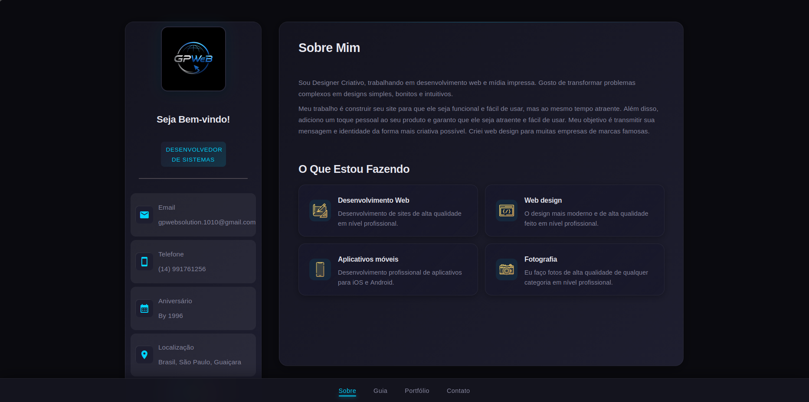

<p align="center">
  
</p>

<h1 align="center">GPWebSolution - Portfólio Pessoal</h1>

<p align="center">
  Portfólio pessoal apresentando projetos, habilidades e recursos de desenvolvimento web.
</p>

<p align="center">
  <a href="https://gregorioponciano.github.io/portfolio"><strong>Visualizar Portfólio Online</strong></a>
</p>

---

## Sobre Este Repositório

Este é um site estático construído com **HTML, CSS e JavaScript puro**, publicado via GitHub Pages. Não utiliza frameworks, build tools ou backend — é um portfólio de apresentação com design escuro, animações de scroll e interface responsiva.

### Stack deste projeto

- **HTML5** — Estrutura semântica, meta tags Open Graph, acessibilidade
- **CSS3** — Design tokens centralizados (`variables.css`), custom properties, glassmorphism, gradientes, responsivo com media queries
- **JavaScript vanilla** — Módulos IIFE, IntersectionObserver para animações, sem dependências externas

### Estrutura de arquivos

```
portfolio/
├── inicio.html              # Página única com 4 seções (Sobre, Guia, Portfólio, Contato)
├── css/
│   ├── variables.css        # Design tokens centralizados (cores, tipografia, espaçamento)
│   ├── style.css            # Layout principal, header, menu, modal
│   ├── sobre.css            # Seção "Sobre Mim"
│   ├── portfolio.css        # Seção "Portfólio"
│   ├── contatos.css         # Seção "Contato" e mapa
│   ├── guia.css             # Seção "Guia do Programador" e acordeão
│   └── animations.css       # Animações de scroll/reveal e transições
├── js/
│   ├── showMenu.js          # Navegação entre seções via data-section
│   ├── guia.js              # Acordeão do guia + busca por tópicos
│   ├── show-contacts.js     # Toggle de contatos no mobile
│   ├── confirma-download.js # Modal de confirmação de download
│   └── scrollAnimations.js  # IntersectionObserver para reveal de elementos
├── images/                  # Ícones, logos e imagens de projetos
└── download/                # Arquivos para download (extras didáticos)
```

---

## Stack Profissional do Autor

No dia a dia profissional, trabalho com:

- **Backend:** PHP (Laravel), MySQL, Node.js
- **Frontend:** Blade, Tailwind CSS, JavaScript (ES6+), Alpine.js
- **Ferramentas:** Git/GitHub, Docker, Termux, VPS
- **Integrações:** Gateways de Pagamento, APIs de Terceiros

> Este site em si é estático e não utiliza nenhuma dessas ferramentas backend — ele é apenas o portfólio de apresentação.

---

## Projetos em Destaque

| Projeto | Descrição | Link |
| :--- | :--- | :--- |
| **Audify** | Aplicativo de música desenvolvido em Flutter | [Download APK](download/audify.apk) |
| **Saas Mesa** | Sistema de delivery | [GitHub](https://github.com/gpwebsolution/saas-mesa) |
| **GPWeb BET** | Cassino online | [GitHub](https://github.com/gpwebsolution/gpweb-bet) |
| **Ecommerce** | Loja online pessoal | [GitHub](https://github.com/gpwebsolution/ecommerce) |

---

## Funcionalidades

- **Design responsivo** com breakpoints em 1249px, 1025px, 768px e 400px
- **Dark mode** com paleta baseada em CSS custom properties
- **Animações de scroll** via IntersectionObserver (reveal, scale, fade)
- **Guia do Programador** com 18+ tópicos e busca integrada
- **Modal de download** com confirmação, fechamento por ESC/overlay/click-outside
- **SEO básico** com meta description, Open Graph e semantic HTML
- **Acessibilidade** com `prefers-reduced-motion`, alt texts e contraste WCAG AA

---

## Como Rodar

1. Clone o repositório:
   ```bash
   git clone https://github.com/gregorioponciano/portfolio.git
   ```

2. Abra `inicio.html` no navegador:
   ```bash
   # Linux
   xdg-open inicio.html

   # macOS
   open inicio.html
   ```

Ou acesse diretamente via [GitHub Pages](https://gregorioponciano.github.io/portfolio).

---

## Licença

Este projeto está sob a licença MIT. Veja o arquivo [LICENSE](LICENSE) para mais detalhes.
